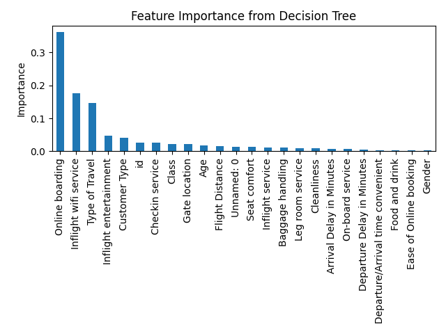
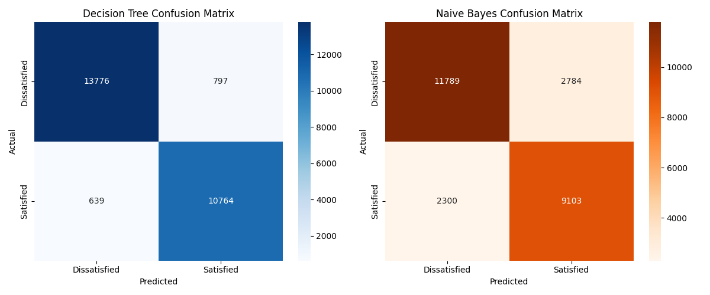

# Airport Passenger Satisfaction Analysis

This repository explores and models airline passenger satisfaction using various flight and demographic metrics. The primary objective is to build a machine learning model that can accurately predict whether a passenger will be **Satisfied** or **Neutral/Dissatisfied** based on their survey responses.

### The Dataset
The data used in this project is the popular [Airline Passenger Satisfaction dataset from Kaggle](https://www.kaggle.com/datasets/teejmahal20/airline-passenger-satisfaction). It includes over 100,000 passenger records containing demographic details (like Age and Gender), flight details (like Class and Flight Distance), and 1-5 ratings on various service aspects (like Inflight Wi-Fi, Seat comfort, Cleanliness, and Leg room).

## Project Structure

- `data/`: Contains the `train.csv` and `test.csv` datasets. *(Note: These files are ignored in Git to save space. You can download them from the Kaggle link above and place them here).*
- `src/`: Contains the main Python script `train.py` for model training and evaluation.
- `airport_satisfaction_analysis.ipynb`: Original Jupyter Notebook with the analysis.
- `decision_tree_viz.pdf`: Generated visualization of the Decision Tree model (depth 3).
- `feature_importances.png`: Visual representation of which features impact passenger satisfaction the most.
- `confusion_matrices.png`: Heatmaps showing the accuracy of both models on the test set.

## Environment Setup

This project uses `uv` for fast dependency management.

1. Ensure `uv` is installed on your system.
2. The dependencies are defined in `pyproject.toml`. To run the script, simply execute:
   ```bash
   uv run python src/train.py
   ```

## Models Used

The script trains two distinct models:
- **Decision Tree Classifier:** Achieved roughly ~94.4% accuracy. The most critical features were found to be *Online boarding*, *Inflight wifi service*, and *Type of Travel*.
- **Gaussian Naive Bayes:** Achieved ~80.4% accuracy.

By comparing both models, the Decision Tree is the recommended model for predicting passenger satisfaction with this dataset.

## Visualizations

Here are some key visualizations generated from the analysis:

### Feature Importances (Decision Tree)


### Confusion Matrices


## Full Analysis

For a complete breakdown of the exploratory data analysis, intermediate steps, and additional visualizations (such as the feature correlation map), please refer to the original Jupyter Notebook: `airport_satisfaction_analysis.ipynb`.
